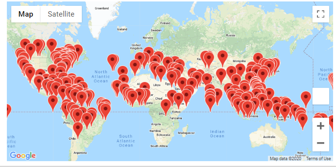
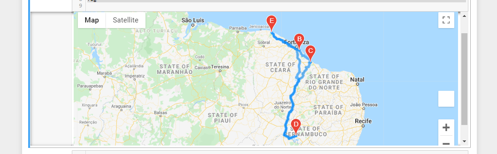
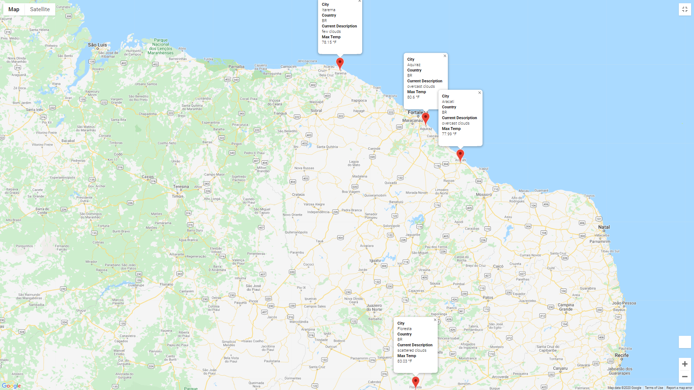

# World_Weather_Analysis

## Project Overview

The purpose of this analysis was to provide WeatherPy with:
-	A collection and analyzation of weather data across cities worldwide

-	Build the PlanMyTrip app to use data to recommend ideal hotels based of a clients weather preferences

## Summary

After completing the tasks of collecting weather data from the Open Weather App, I was able to create a destination map based off a clients preferred temperature.  I then further created an itinerary map where the client can pick 4 locations and it shows directions from start to end with multiple waypoints.

## Resources
- Data Source: WeatherPy_Database.csv, WeatherPy_vacation.csv, and Google Maps Directions and Open Weather App api’s
- Software: Python 3.7, Jupyter Notebook, Pandas library, Mtplotlib.pyplot library, Datetime Module, Citypy module, Gmaps library, Requests module, and Numpy library
